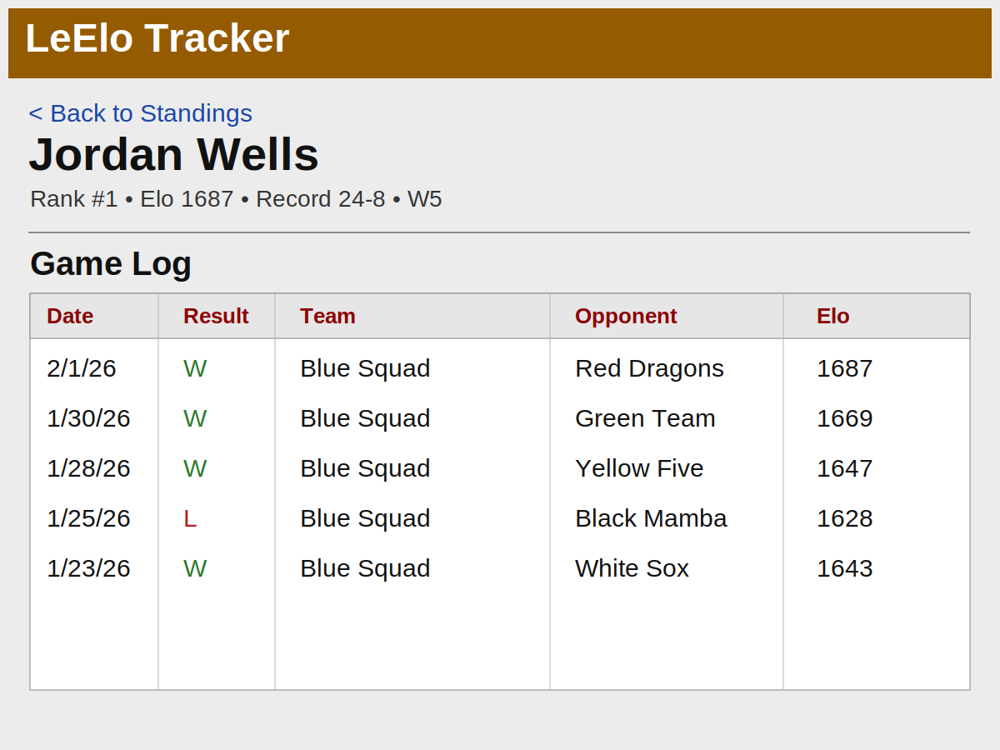

# UI Reference Refresh

Approved visual direction date: **February 9, 2026**

These mockups are the accepted target style for the LeElo Tracker refresh.

## Mockups

### Rankings
`docs/ui-reference-refresh/mockup-rankings.svg`

### Player Detail
`docs/ui-reference-refresh/mockup-player.svg`

## Style Summary

- Flat legacy reference-site styling
- Gray page background + brown masthead bar
- Dense white/gray tables with clear border grid
- Arial/Helvetica typography
- Blue underlined links
- Dark red table section/header labels
- Mobile keeps table-first behavior (column priority + horizontal scroll)

## Documentation Links

- `DESIGN.md`
- `FRONTEND_PLAN.md`
